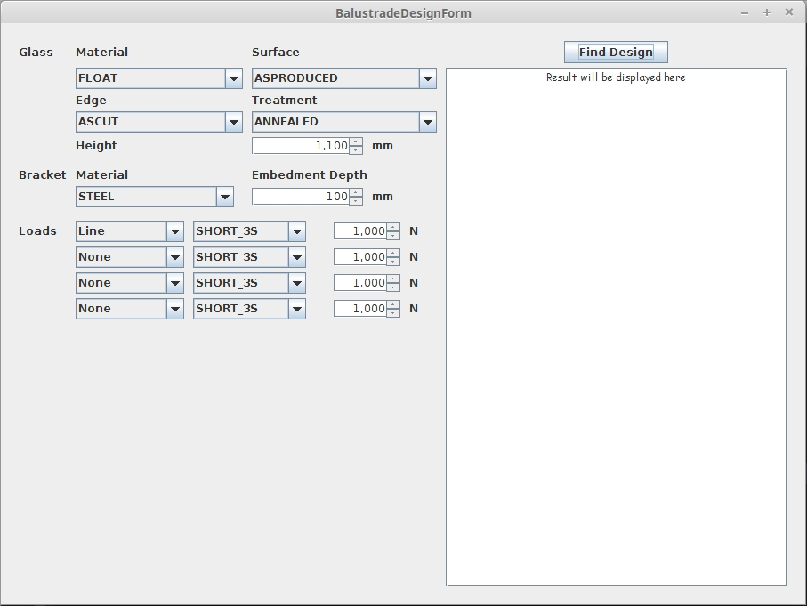

# structures
Tools for automated structural engineering calculations

This project is for creating a tool for finding suitable design specifications for glass balustrades.

To use the code open the project with IntelliJ and build/run "BalustradeGUI" to generate the latest version of out/artifacts/structures_jar/structures.jar 

Then run structures.jar

